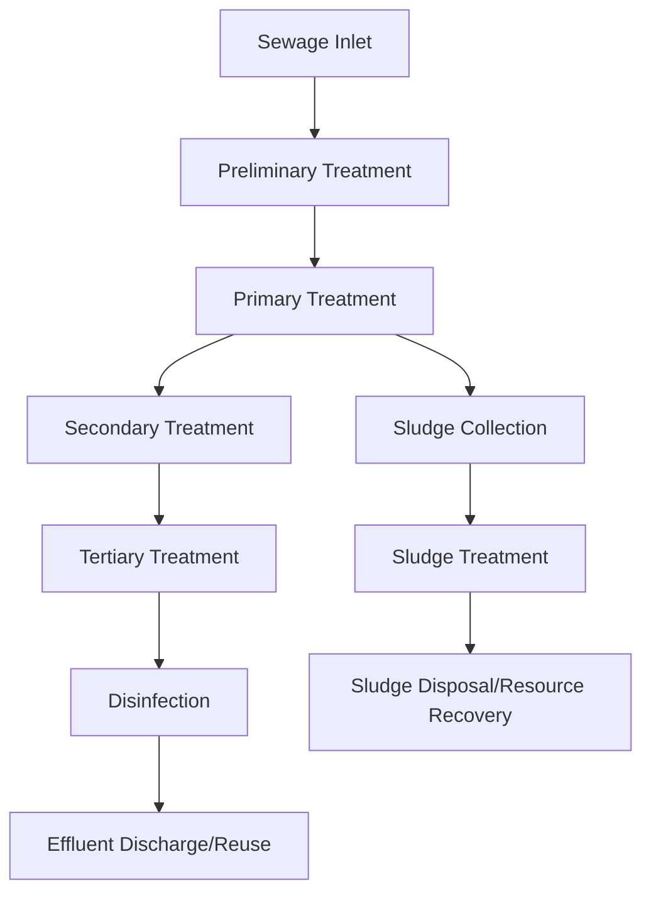

at coimbatore 

---
[[Coimbatore SWT News]]
[[PPP Model for Water Treatment]]
[[WABAG]]
[[stocks to look out for in Water Treatement]]
[[water treatment CAGR]]
[[Water Treatment Books]]

will be a great addition to our profile 

2025-03-10
11:06
Need water treatement plants - 2 in Cbe 

# Sewage Water Treatement 
---

# Comprehensive Analysis of Sewage Water Treatment Plants: Processes, Technologies, and Future Directions

Sewage treatment plants (STPs) are critical infrastructure for modern urban and industrial ecosystems, designed to mitigate environmental pollution and protect public health by treating wastewater before its discharge or reuse. This report synthesizes current methodologies, technological advancements, and emerging trends in sewage treatment, drawing from recent research and operational practices. Key findings highlight the evolution from conventional activated sludge systems to advanced resource recovery mechanisms, the integration of AI and IoT for operational optimization, and the growing emphasis on decentralized and nature-based solutions. By 2025, the sector is poised to achieve unprecedented efficiency through innovations in membrane bioreactors, nutrient recovery, and ultraviolet disinfection, while addressing challenges such as energy consumption and sludge management.

## Introduction to Sewage Treatment Plants

Sewage treatment plants (STPs) are engineered systems that remove physical, chemical, and biological contaminants from wastewater generated by households, industries, and commercial establishments. The primary objective is to produce effluent safe for discharge into water bodies or reuse in agriculture, industrial processes, or groundwater recharge[1](https://susbio.in/role-and-importance-of-sewage-treatment-plants-how-they-function/)[10](https://en.wikipedia.org/wiki/Sewage_treatment). Untreated sewage poses significant risks to ecosystems and human health due to pathogens, organic pollutants, and nutrient overloads that cause eutrophication[16](https://www.membracon.co.uk/blog/what-is-a-sewage-treatment-plant-how-does-it-work-2/). Modern STPs employ a multi-stage process—primary, secondary, and tertiary treatment—to achieve compliance with environmental regulations[11](https://chem.libretexts.org/Bookshelves/Introductory_Chemistry/Chemistry_for_Changing_Times_\(Hill_and_McCreary\)/14:_Water/14.08:_Wastewater_Treatment)[15](https://www.ppsthane.com/blog/sewage-treatment-plant-process-stp).

## Stages of Sewage Treatment

## Primary Treatment: Physical Separation of Solids

The initial phase focuses on removing coarse solids and settleable organic matter. Wastewater first passes through **bar screens** to capture debris like plastics, rags, and sticks[2](https://www.oconomowoc-wi.gov/270/Treatment-Steps)[16](https://www.membracon.co.uk/blog/what-is-a-sewage-treatment-plant-how-does-it-work-2/). Subsequently, **grit chambers** allow sand, gravel, and other dense particles to settle, preventing abrasion in downstream equipment[1](https://susbio.in/role-and-importance-of-sewage-treatment-plants-how-they-function/)[6](https://www.iosrjournals.org/iosr-jmce/papers/vol13-issue5/Version-5/D1305052531.pdf). In **primary sedimentation tanks**, wastewater is held for 1–3 hours, enabling heavier sludge to settle and lighter fats/oils to float for skimming[2](https://www.oconomowoc-wi.gov/270/Treatment-Steps)[15](https://www.ppsthane.com/blog/sewage-treatment-plant-process-stp). This stage reduces suspended solids by 50–60% and biochemical oxygen demand (BOD) by 30–40%, producing primary sludge for further processing[10](https://en.wikipedia.org/wiki/Sewage_treatment)[15](https://www.ppsthane.com/blog/sewage-treatment-plant-process-stp).

## Secondary Treatment: Biological Degradation

Secondary treatment employs microorganisms to metabolize dissolved organic matter. **Activated sludge systems** are widely used, where aeration tanks supply oxygen to aerobic bacteria that break down pollutants[9](https://www.pcimembranes.com/articles/membrane-bioreactors-mbr-for-wastewater-treatment/)[15](https://www.ppsthane.com/blog/sewage-treatment-plant-process-stp). Mixed liquor from these tanks flows to **secondary clarifiers**, where microbial flocs settle as sludge, partially recycled to maintain biomass activity[2](https://www.oconomowoc-wi.gov/270/Treatment-Steps)[10](https://en.wikipedia.org/wiki/Sewage_treatment). Alternatives include **trickling filters**, which pass wastewater over biofilm-coated media, and **moving bed biofilm reactors (MBBR)** with suspended carriers to enhance microbial surface area[12](https://susbio.in/best-sewage-treatment-plants-in-2025-a-comprehensive-guide/)[16](https://www.membracon.co.uk/blog/what-is-a-sewage-treatment-plant-how-does-it-work-2/). These systems achieve 85–90% BOD removal and are critical for reducing eutrophication risks[11](https://chem.libretexts.org/Bookshelves/Introductory_Chemistry/Chemistry_for_Changing_Times_\(Hill_and_McCreary\)/14:_Water/14.08:_Wastewater_Treatment)[15](https://www.ppsthane.com/blog/sewage-treatment-plant-process-stp).

## Tertiary Treatment: Polishing and Disinfection

Tertiary processes target residual contaminants, including nutrients (nitrogen, phosphorus), pathogens, and micropollutants. **Sand filtration** and **membrane bioreactors (MBR)** with ultrafiltration membranes (0.01–0.1 µm pores) remove fine particulates and microbes[9](https://www.pcimembranes.com/articles/membrane-bioreactors-mbr-for-wastewater-treatment/)[10](https://en.wikipedia.org/wiki/Sewage_treatment). **Chemical coagulation** with alum or ferric chloride precipitates phosphates, while **UV disinfection** or chlorination inactivates bacteria and viruses[4](https://testbook.com/civil-engineering/sewage-treatment-plant-diagram-and-process)[11](https://chem.libretexts.org/Bookshelves/Introductory_Chemistry/Chemistry_for_Changing_Times_\(Hill_and_McCreary\)/14:_Water/14.08:_Wastewater_Treatment). Advanced systems incorporate **constructed wetlands** or **ozonation** to degrade pharmaceutical residues and endocrine disruptors[5](https://staluk.co.uk/emerging-trends-in-wastewater-treatment-for-2025/)[8](https://www.linkedin.com/pulse/new-horizons-global-wastewater-sludge-treatment-2025-katherine-yqsce). Effluent from this stage meets stringent standards for reuse in irrigation or industrial cooling[10](https://en.wikipedia.org/wiki/Sewage_treatment)[12](https://susbio.in/best-sewage-treatment-plants-in-2025-a-comprehensive-guide/).

## Sludge Treatment and Resource Recovery

Sludge, a by-product of primary and secondary treatment, undergoes stabilization to reduce volume and pathogen content. **Anaerobic digestion** in heated tanks converts organic matter into biogas (60–70% methane), which can generate electricity or heat[8](https://www.linkedin.com/pulse/new-horizons-global-wastewater-sludge-treatment-2025-katherine-yqsce)[10](https://en.wikipedia.org/wiki/Sewage_treatment). Dewatering via centrifuges or belt presses reduces moisture content, producing biosolids for agricultural use as soil conditioners[4](https://testbook.com/civil-engineering/sewage-treatment-plant-diagram-and-process)[16](https://www.membracon.co.uk/blog/what-is-a-sewage-treatment-plant-how-does-it-work-2/). Emerging techniques like **hydrothermal liquefaction** recover bio-oil from sludge, while **phosphorus extraction** from ash addresses mineral scarcity[5](https://staluk.co.uk/emerging-trends-in-wastewater-treatment-for-2025/)[8](https://www.linkedin.com/pulse/new-horizons-global-wastewater-sludge-treatment-2025-katherine-yqsce).

## Technological Innovations in Sewage Treatment

## Membrane Bioreactors (MBR)

MBR systems integrate biological treatment with microfiltration/ultrafiltration membranes, eliminating secondary clarifiers. They achieve >95% BOD removal and produce effluent with <5 mg/L suspended solids, suitable for direct reuse[9](https://www.pcimembranes.com/articles/membrane-bioreactors-mbr-for-wastewater-treatment/)[12](https://susbio.in/best-sewage-treatment-plants-in-2025-a-comprehensive-guide/). Submerged MBR configurations reduce energy use by 20–30% compared to sidestream systems, though membrane fouling remains a challenge mitigated by periodic backwashing[9](https://www.pcimembranes.com/articles/membrane-bioreactors-mbr-for-wastewater-treatment/)[12](https://susbio.in/best-sewage-treatment-plants-in-2025-a-comprehensive-guide/).

## Decentralized and Modular Systems

Decentralized STPs, such as **package treatment plants**, serve remote communities and industrial parks with scalable, low-energy designs. Technologies like **sequential batch reactors (SBR)** and **integrated fixed-film activated sludge (IFAS)** enable flexible operation, adapting to fluctuating loads without extensive infrastructure[5](https://staluk.co.uk/emerging-trends-in-wastewater-treatment-for-2025/)[13](https://transcendinfra.com/wastewater-treatment-plant-design/).

## AI and IoT Integration

Smart sensors monitor real-time parameters (pH, dissolved oxygen, turbidity), feeding data to AI models that optimize aeration, chemical dosing, and sludge retention times. Predictive maintenance algorithms reduce downtime by 15–20%, while machine learning enhances nutrient removal efficiency[5](https://staluk.co.uk/emerging-trends-in-wastewater-treatment-for-2025/)[8](https://www.linkedin.com/pulse/new-horizons-global-wastewater-sludge-treatment-2025-katherine-yqsce).

## Environmental and Public Health Impacts

Effective sewage treatment prevents waterborne diseases (e.g., cholera, typhoid) and protects aquatic ecosystems from oxygen depletion and toxic algal blooms[1](https://susbio.in/role-and-importance-of-sewage-treatment-plants-how-they-function/)[16](https://www.membracon.co.uk/blog/what-is-a-sewage-treatment-plant-how-does-it-work-2/). Tertiary-treated effluent replenishes rivers and aquifers, mitigating water scarcity—a critical benefit for regions like Chennai, where groundwater levels are declining[8](https://www.linkedin.com/pulse/new-horizons-global-wastewater-sludge-treatment-2025-katherine-yqsce)[12](https://susbio.in/best-sewage-treatment-plants-in-2025-a-comprehensive-guide/). However, inadequate sludge management can lead to heavy metal accumulation in soils, necessitating stringent regulatory oversight[4](https://testbook.com/civil-engineering/sewage-treatment-plant-diagram-and-process)[10](https://en.wikipedia.org/wiki/Sewage_treatment).

## Challenges and Future Directions

## Energy Consumption and Carbon Footprint

STPs account for 1–3% of global electricity use, primarily for aeration and pumping[5](https://staluk.co.uk/emerging-trends-in-wastewater-treatment-for-2025/)[8](https://www.linkedin.com/pulse/new-horizons-global-wastewater-sludge-treatment-2025-katherine-yqsce). Innovations like **anammox bacteria** for nitrogen removal cut energy demands by 60%, while **solar-powered aeration** and **microbial fuel cells** transform STPs into net energy producers[3](https://www.science.gov/topicpages/w/wastewater+treatment+research)[5](https://staluk.co.uk/emerging-trends-in-wastewater-treatment-for-2025/).

## Policy and Financing

Developing nations face hurdles in funding advanced STPs, requiring public-private partnerships and green bonds[8](https://www.linkedin.com/pulse/new-horizons-global-wastewater-sludge-treatment-2025-katherine-yqsce)[13](https://transcendinfra.com/wastewater-treatment-plant-design/). Regulatory frameworks must incentivize water reuse and circular economy practices, such as phosphorus recovery credits[8](https://www.linkedin.com/pulse/new-horizons-global-wastewater-sludge-treatment-2025-katherine-yqsce)[10](https://en.wikipedia.org/wiki/Sewage_treatment).

## Conclusion

Sewage treatment plants are evolving from pollution control systems to resource recovery hubs, aligning with global sustainability goals. The adoption of MBRs, AI-driven optimization, and decentralized models will dominate the sector through 2025, enhancing resilience against urbanization and climate change. Future research must prioritize low-cost technologies for equitable access and integrate STPs with urban water cycles to achieve closed-loop resource management.

#perplexity 

---
#ChatGPT 

# what are the alternatives to sewage water treatment plants, that can be implemented in the future? What are the latest emerging options?

There is a broad and exciting array of alternatives and emerging options that could eventually complement or even replace traditional centralized sewage water treatment plants. In essence, future solutions are shifting from a “one-size‐fits‐all” centralized approach to a more flexible, decentralized, and resource‐recovery-focused system. Here are some key areas:

---

### 1. Decentralized & On‐Site Treatment Systems

- **Decentralized Wastewater Treatment (DEWATS):**  
    Small-scale, modular treatment systems (such as anaerobic baffled reactors, constructed wetlands, and vacuum or grinder pump–based solutions) can be installed at the community or even household level. These systems reduce the need for long, centralized sewer networks and offer resilience, especially in challenging terrains or rapidly growing urban areas.
    
- **On-Site Sanitation Innovations:**  
    Technologies like the Generation 2 Reinvented Toilet (G2RT) developed by Lixil, which treat waste at the source without relying on conventional sewer connections, illustrate how “toilet technologies” could be reinvented to both manage waste and recover resources.
    

---

### 2. Nature-Based & Green Solutions

- **Constructed Wetlands and Reed Beds:**  
    These systems use natural processes—with plants, soil, and microorganisms—to filter and degrade contaminants. They can be designed as surface flow or subsurface systems and often provide additional benefits like wildlife habitat and recreational green space.
    
- **Phytoremediation and Biofiltration:**  
    Leveraging specific plant species and microbial communities, these systems can break down organic pollutants and remove nutrients, potentially turning wastewater into a resource for agriculture.
    

---

### 3. Biological & Advanced Membrane Technologies

- **Membrane Bioreactors (MBRs):**  
    Compact, high-rate systems that combine biological treatment with membrane filtration. They are particularly promising for decentralized settings where space is limited, and they can achieve high-quality effluent suitable for water reuse.
    
- **Microbial Fuel Cells (MFCs):**  
    These innovative systems harness the power of specialized bacteria to convert organic pollutants into electricity while simultaneously treating wastewater. Although still emerging, MFCs could offer energy recovery benefits that traditional treatment lacks.
    
- **Algae-Based Wastewater Treatment:**  
    Algal photobioreactors use sunlight and algae to uptake nutrients and contaminants, producing biomass that can be further processed into biofuels or fertilizer. They offer a dual benefit of wastewater treatment and renewable resource generation.
    

---

### 4. Resource Recovery & Advanced Chemical Processes

- **Anaerobic Digestion and Bioenergy Recovery:**  
    Instead of simply treating sewage, anaerobic digestion can convert organic waste into biogas, providing renewable energy while reducing sludge volume.
    
- **Struvite and Phosphorus Recovery:**  
    Technologies that recover nutrients such as phosphorus (often as struvite) not only improve water quality but also generate valuable fertilizers, turning waste into a resource.
    
- **Advanced Oxidation and PFAS Removal:**  
    With growing concern over “forever chemicals” like PFAS, emerging chemical treatment processes (e.g., advanced oxidation processes, membrane technologies) are being developed to more effectively remove persistent contaminants that traditional treatments struggle with.
    

---

### The Bigger Picture

Future wastewater treatment is likely to be more integrated and multifaceted. Instead of merely “cleaning” water, treatment systems will aim to recover resources—energy, nutrients, and even water itself—to close the loop in a circular economy. This means technologies will increasingly be judged not only on their pollutant removal efficiency but also on how well they reduce energy consumption, lower greenhouse gas emissions, and create byproducts that have economic value.

---

### In Summary

The future of wastewater treatment may involve a blend of:

- **Decentralized, on-site systems** (e.g., innovative toilet designs and small-scale treatment units) that reduce infrastructure costs and improve resilience.
- **Nature-based solutions** (constructed wetlands, reed beds) that offer low-energy, multi-benefit approaches.
- **Advanced membrane and bioelectrochemical systems** (MBRs, MFCs, algae-based reactors) that not only treat wastewater but also generate energy or produce high-quality reclaimed water.
- **Resource recovery processes** (anaerobic digestion, struvite recovery, advanced oxidation) that transform waste into useful commodities.

These emerging options promise a future where wastewater is managed sustainably, turning an environmental burden into an opportunity for resource recovery and circular economy benefits.

---

This comprehensive shift toward decentralized and resource-recovery systems is supported by ongoing research and pilot projects worldwide, demonstrating that tomorrow’s water management could be both more efficient and environmentally friendly.

---
# Process 
Below is an example flowchart outlining the typical steps in a sewage water treatment process. The process is divided into several stages, including preliminary, primary, secondary, tertiary treatment, disinfection, and finally handling of the resulting sludge.

### Process Breakdown:

- **Preliminary Treatment:**  
    _Screening & Grit Removal_ – Removes large solids and grit to protect downstream equipment.
    
- **Primary Treatment:**  
    _Sedimentation/Primary Clarification_ – Settles out suspended solids from the wastewater.
    
- **Secondary Treatment:**  
    _Biological Treatment (Activated Sludge/Trickling Filters)_ – Uses microbes to biodegrade organic matter. _Secondary Clarification_ – Further settling of biomass to separate treated water from sludge.
    
- **Tertiary Treatment:**  
    _Filtration, Nutrient Removal, etc._ – Polishes the effluent to remove additional contaminants.
    
- **Disinfection:**  
    _Chlorination, UV or Ozone_ – Kills any remaining pathogens before discharge.
    
- **Effluent Discharge/Reuse:**  
    Treated water is discharged into receiving water bodies or reused (e.g., irrigation, industrial processes).
    
- **Sludge Treatment:**  
    Sludge from primary and secondary processes is treated (thickening, digestion, dewatering) and then disposed of or processed for resource recovery (e.g., fertilizer, energy).
    

This flowchart represents a generalized sewage treatment process; actual plants might vary slightly depending on local regulations, treatment goals, and technologies used.

---

